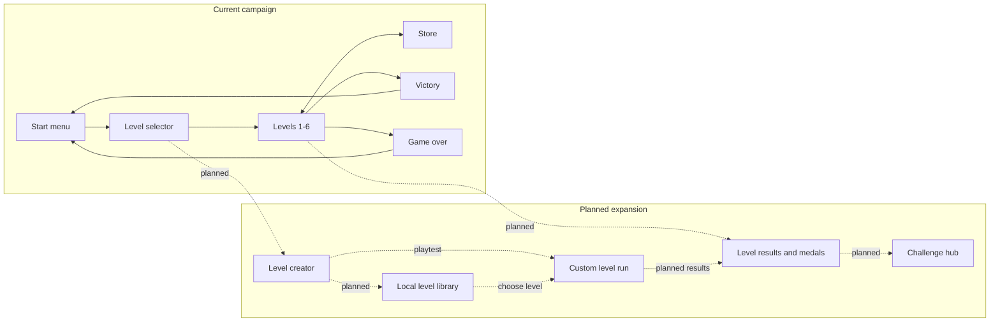

# QuantumQuarry

<p align="center">
  
  
</p>

QuantumQuarry is a retro-inspired 2D platformer developed in Unity as the practical part of my bachelor thesis, **"Izrada retro platformera u programskom alatu Unity"** (Building a Retro Platformer in Unity).

The project explores a complete platform-game loop across six levels: movement and combat, hazards and enemies, collectible currency, a store with temporary power-ups, level progression, and persistent run state.

## Gameplay

- Six playable levels with a level-selection screen
- Running, jumping, double jumping, ladder climbing, and shooting
- State-driven enemies, water and spike hazards, and moving platforms
- Quantum Stability: enemy and spike damage, knockback, and hit invulnerability
- Critical-stability overdrive that doubles collected coin value at one remaining stability
- Buoyant swimming with level-scaled breath, half-point drowning damage, and lethal lava
- Physics-driven moving platforms that carry idle players and preserve jump momentum
- Distinct 100, 150, and 200-value coins with size, color, pulse, and pickup feedback
- A responsive store with stackable speed, invisibility, and double-jump inventory
- Safe ghost movement that prevents rematerializing inside solid platforms
- Pause, victory, and game-over flows
- Quarry Pressure source implementation: unbanked ore, risk/reward multipliers, seeded enemy modifiers, and reward previews
- Custom banking checkpoint and pulse-vent prefabs with a Level 4 pilot and ore route (automated Unity runtime checks pass; manual route acceptance remains pending)

## Enemy AI

Enemies use a deterministic finite-state machine with `Patrol`, `Alert`, `Chase`, and `Search` states. They detect visible players within a level-scaled range, respect terrain line of sight, and investigate briefly after losing their target. Patrol detection is directional, so approaching from behind or using the invisibility power-up creates a stealth option.

Detection range and chase speed increase from Level 1 through Level 6. Both the standard and red enemy prefabs inherit the behavior from the same controller, keeping difficulty progression consistent across the campaign.

## Controls

| Action | Keyboard and mouse | Gamepad |
| --- | --- | --- |
| Move / climb | `WASD` or arrow keys | Left stick |
| Swim | `WASD` or arrow keys | Left stick |
| Jump | `Space` | South button |
| Shoot | Left mouse button | Right trigger |

Menus support mouse, keyboard, and gamepad navigation through Unity's Input System.

The HUD spells out `Lives`, `Stability`, and `Banked`. `Coins x2` indicates the critical-Stability bonus, which stacks with Quarry Pressure. The pressure HUD shows the combined multiplier and carried rewards; labels over coins preview their exact award. Store entry and level exits bank carried rewards; death loses only unbanked ore. While the player's head is underwater, `Breath` shows the remaining safe submersion time; after it reaches zero, drowning removes `0.5` Stability per tick until the player surfaces.

### Trying the Pressure vent

Play **Level 4** from level selection, or open `Assets/Levels/Level 4.unity` in the Editor and press **Play**. Normal Editor play uses your campaign save; back it up before testing death or resets. The bank is in the upper-left alcove near `(-12, 8.516)` and the vent is before the right-hand exit near `(27, 5.516)`.

The vent is a timed contact hazard, not a button, jump pad, or collectible. It arms automatically at **1500 carried base ore**. Banked coins and reward bonuses do not count toward that threshold. Level 4 has 1550 base ore in total, and every pickup is worth at least 100 base ore, so you currently need all 15 pickups without banking or dying to arm it naturally.

| World label | Meaning | Contact damage |
| --- | --- | --- |
| `OFF` | Below 1500 carried ore; no pulse cycle | None |
| `SAFE` | Armed, first 3.5 seconds of the cycle | None |
| `WARNING` | Yellow pulsing warning for the next 1.5 seconds | None |
| `DANGER` | Red active phase for the final 1 second | 1 Stability before armor rules |

Once armed, the six-second cycle repeats even when you are far away. **Wait beside it, then cross or jump over its small trigger during `SAFE`.** `WARNING` is still harmless, but signals that you should clear the trigger before `DANGER`. Red text does not hurt you at a distance; your player must overlap the vent. Invisibility protects you, and the normal one-second hit-invulnerability window prevents repeated immediate hits. Armor uses the existing half-point rounding rules; the current armor tiers do not reduce this particular one-point hit.

Touching the bank deposits your carried reward and turns the vent `OFF`; it requires no interaction key. The bank does not heal you or set a respawn point. Store entry and level completion also bank ore. Death/reset discard the carried reward and clear Pressure. Changing Pressure tier restarts the safe interval; pausing freezes the cycle. Reaching a vent does not restart its timer.

The HUD's `Pressure 1/2/3` notices occur at **500/1500/3000 base ore**. Subsequent pickups pay **x1.25/x1.5/x1.75** (doubled at critical Stability). The pickup that crosses a threshold uses the previous multiplier. `Watchful patrols` means increased enemy detection range; `Swift pursuit` adds faster chasing as well. These are enemy modifiers, not vent phase names.

The single bank/vent pair is a pilot, not a finished campaign-wide layout. In particular, Store entry is currently another way to bank, and the route barely exceeds the vent threshold. Those choices still need human playtesting before expanding the mechanic or claiming the bank creates a compelling detour.

### Level 6 lava

Level 6 now uses original animated lava tiles rather than a dark tint over the water artwork. Bright yellow-orange surfaces and moving red crust distinguish lethal lava from the blue, swimmable water in earlier levels.

Open `Assets/Levels/Level 6.unity` and press **Play**, or reach Level 6 through the campaign. The new artwork is visible in the Editor as well as in the player. The existing 25 liquid cells, level layout, collider outlines, and death rules are preserved: lava kills on contact, while invisibility protects you. Armor does not make lava survivable.

**Tools > QuantumQuarry > Lava > Create Level 6 Artwork** creates the two four-frame tile assets and updates Level 6 through Unity's authoring APIs. It preserves existing artwork and refuses to operate on a dirty Level 6 scene. See the [lava authoring checks](docs/DEVELOPMENT_WORKFLOW.md#level-6-lava-artwork).

## Getting Started

### Requirements

- Unity Hub
- Unity Editor `2022.3.12f1` (LTS)
- Git

### Open and run

Clone the repository:

```bash
git clone https://github.com/jagarkarlo/quantum-quarry.git
cd quantum-quarry
```

1. In Unity Hub, select **Add project from disk** and choose the repository root.
2. Open the project with Unity `2022.3.12f1` and allow Unity to restore the packages.
3. Open `Assets/Levels/Start.unity`.
4. Press **Play**.

To create a standalone build, open **File > Build Settings**, choose a supported desktop target, confirm the configured scenes, and select **Build**.

## Game Flow



Solid arrows describe the 11 scenes already enabled in `ProjectSettings/EditorBuildSettings.asset`. Dashed arrows show planned systems and are not implemented yet.

## Expansion

Development is continuing in small, testable milestones: dynamic Quarry Pressure, a deeper store and progression system, a versioned custom-level format, an in-game level creator with playtesting and undo/redo, and safe local level sharing. See [`docs/ROADMAP.md`](docs/ROADMAP.md) for the implementation order and acceptance boundaries.

See [`docs/DEVELOPMENT_WORKFLOW.md`](docs/DEVELOPMENT_WORKFLOW.md) for Git synchronization and the Unity 6 migration procedure.

Run **Tools > QuantumQuarry > Validate Project** in Unity before testing a change. The validator checks build scenes, core prefabs, Store and Quantum Stability rules, Store bindings, and large-coin placement. For command-line validation:

```bash
Unity -batchmode -quit -projectPath "$PWD" \
  -executeMethod QuantumQuarryProjectValidator.ValidateBatch -logFile -
```

Quarry Pressure's package-free tests can run with .NET 8:

```bash
dotnet run --project Tests/PressureRules/PressureRules.csproj
```

These execute the real pressure rules and session logic against Unity test doubles, validate the custom artwork, and parse Unity sources for C# 9 syntax. They do not replace Unity compilation or Play Mode. See the [pressure authoring and verification procedure](docs/DEVELOPMENT_WORKFLOW.md#quarry-pressure-validation).

On Windows, close this project's Unity Editor and run `.\Tests\ValidateUnity.ps1 -BuildWindowsPlayer` in PowerShell to validate the project and custom prefabs and build the Windows player. See the [Windows validation instructions](docs/DEVELOPMENT_WORKFLOW.md#windows-validation) for options and log locations.

Run `.\Tests\ValidateRuntime.ps1` for controlled real-physics checks and screenshots in a separate save-isolated player. See [runtime validation and its limitations](docs/DEVELOPMENT_WORKFLOW.md#isolated-runtime-validation).

## Project Structure

```text
Assets/
  Entry/             Input System actions and settings
  Levels/            Menus, six game levels, store, and end states
  Prefabs/           Player, enemies, UI, collectibles, and shared objects
  Scripts/           C# gameplay and UI logic
  Sprites/           Character, environment, and interface artwork
  Tiles/             Tile assets and level-authoring palettes
Packages/             Reproducible Unity package dependencies
ProjectSettings/      Unity version and project configuration
```

Unity-generated folders such as `Library`, `Temp`, `Logs`, `obj`, IDE files, and exported builds are intentionally excluded. Unity `.meta` files are source files and must remain tracked because they preserve asset GUID references used by scenes and prefabs.

## Thesis Scope

The implementation demonstrates scene management, Rigidbody2D movement, collision handling, tilemaps, animation, finite-state enemy AI, Unity's Input System, TextMesh Pro UI, persistent state through `PlayerPrefs`, and coroutine-driven temporary abilities.

## Repository History

This repository publishes the completed thesis project through an organized, dependency-aware source import. Its commit sequence groups configuration, gameplay systems, assets, prefabs, and scenes into reviewable boundaries; it does not claim to reproduce the project's original development chronology.

## Assets and Attribution

This repository preserves the assets used to reproduce the submitted educational project. TextMesh Pro's Liberation Sans font is included under the SIL Open Font License in `Assets/TextMesh Pro/Fonts/LiberationSans - OFL.txt`. Provenance and redistribution terms for the remaining artwork, audio, and custom font should be verified before reusing them outside this project.

The original C# scripts in `Assets/Scripts` are source-available, not open source. They may be inspected and run for personal, non-commercial evaluation only. All rights are reserved: modification, redistribution, commercial use, and claims of authorship are prohibited without prior written permission. Separate terms apply to third-party content, and no reuse rights are granted for other project assets. See `LICENSE` and `docs/ASSET_SOURCES.md`.
