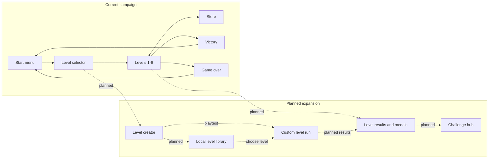

# QuantumQuarry

QuantumQuarry is a retro-inspired 2D platformer developed in Unity as the practical part of my bachelor thesis, **"Izrada retro platformera u programskom alatu Unity"** (Building a Retro Platformer in Unity).

The project explores a complete platform-game loop across six levels: movement and combat, hazards and enemies, collectible currency, a store with temporary power-ups, level progression, and persistent run state.

## Gameplay

- Six playable levels with a level-selection screen
- Running, jumping, double jumping, ladder climbing, and shooting
- State-driven enemies, water and spike hazards, and moving platforms
- Physics-driven moving platforms that carry idle players and preserve jump momentum
- Distinct 100, 150, and 200-value coins with size, color, pulse, and pickup feedback
- A responsive store with stackable speed, invisibility, and double-jump inventory
- Safe ghost movement that prevents rematerializing inside solid platforms
- Pause, victory, and game-over flows

## Enemy AI

Enemies use a deterministic finite-state machine with `Patrol`, `Alert`, `Chase`, and `Search` states. They detect visible players within a level-scaled range, respect terrain line of sight, and investigate briefly after losing their target. Patrol detection is directional, so approaching from behind or using the invisibility power-up creates a stealth option.

Detection range and chase speed increase from Level 1 through Level 6. Both the standard and red enemy prefabs inherit the behavior from the same controller, keeping difficulty progression consistent across the campaign.

## Controls

| Action | Keyboard and mouse | Gamepad |
| --- | --- | --- |
| Move / climb | `WASD` or arrow keys | Left stick |
| Jump | `Space` | South button |
| Shoot | Left mouse button | Right trigger |

Menus support mouse, keyboard, and gamepad navigation through Unity's Input System.

## Getting Started

### Requirements

- Unity Hub
- Unity Editor `2022.3.12f1` (LTS)
- Git

### Open and run

Clone the repository:

```bash
git clone https://github.com/jagarkarlo/quantum-quarry.git
cd quantum-quarry
```

1. In Unity Hub, select **Add project from disk** and choose the repository root.
2. Open the project with Unity `2022.3.12f1` and allow Unity to restore the packages.
3. Open `Assets/Levels/Start.unity`.
4. Press **Play**.

To create a standalone build, open **File > Build Settings**, choose a supported desktop target, confirm the configured scenes, and select **Build**.

## Game Flow



Solid arrows describe the 11 scenes already enabled in `ProjectSettings/EditorBuildSettings.asset`. Dashed arrows show planned systems and are not implemented yet.

## Expansion

Development is continuing in small, testable milestones: a deeper store and progression system, a versioned custom-level format, an in-game level creator with playtesting and undo/redo, and safe local level sharing. See [`docs/ROADMAP.md`](docs/ROADMAP.md) for the implementation order and acceptance boundaries.

See [`docs/DEVELOPMENT_WORKFLOW.md`](docs/DEVELOPMENT_WORKFLOW.md) for Git synchronization and the Unity 6 migration procedure.

Run **Tools > QuantumQuarry > Validate Project** in Unity before testing a change. The validator checks build scenes, core prefabs, store bindings and economy rules, and large-coin placement. For command-line validation:

```bash
Unity -batchmode -quit -projectPath "$PWD" \
  -executeMethod QuantumQuarryProjectValidator.ValidateBatch -logFile -
```

## Project Structure

```text
Assets/
  Entry/             Input System actions and settings
  Levels/            Menus, six game levels, store, and end states
  Prefabs/           Player, enemies, UI, collectibles, and shared objects
  Scripts/           C# gameplay and UI logic
  Sprites/           Character, environment, and interface artwork
  Tiles/             Tile assets and level-authoring palettes
Packages/             Reproducible Unity package dependencies
ProjectSettings/      Unity version and project configuration
```

Unity-generated folders such as `Library`, `Temp`, `Logs`, `obj`, IDE files, and exported builds are intentionally excluded. Unity `.meta` files are source files and must remain tracked because they preserve asset GUID references used by scenes and prefabs.

## Thesis Scope

The implementation demonstrates scene management, Rigidbody2D movement, collision handling, tilemaps, animation, finite-state enemy AI, Unity's Input System, TextMesh Pro UI, persistent state through `PlayerPrefs`, and coroutine-driven temporary abilities.

## Repository History

This repository publishes the completed thesis project through an organized, dependency-aware source import. Its commit sequence groups configuration, gameplay systems, assets, prefabs, and scenes into reviewable boundaries; it does not claim to reproduce the project's original development chronology.

## Assets and Attribution

This repository preserves the assets used to reproduce the submitted educational project. TextMesh Pro's Liberation Sans font is included under the SIL Open Font License in `Assets/TextMesh Pro/Fonts/LiberationSans - OFL.txt`. Provenance and redistribution terms for the remaining artwork, audio, and custom font should be verified before reusing them outside this project.

The original C# scripts in `Assets/Scripts` are source-available, not open source. They may be inspected and run for personal, non-commercial evaluation only. All rights are reserved: modification, redistribution, commercial use, and claims of authorship are prohibited without prior written permission. Separate terms apply to third-party content, and no reuse rights are granted for other project assets. See `LICENSE` and `docs/ASSET_SOURCES.md`.
